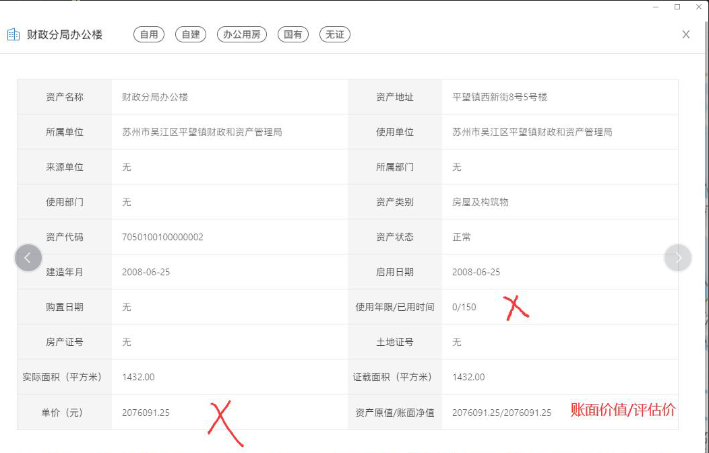

- 平望资产一张图需要更改部分
	- DONE 资产一张图默认加载加载10条，更改显示默认500条
	  :LOGBOOK:
	  CLOCK: [2022-06-13 Mon 13:59:21]--[2022-06-13 Mon 13:59:21] =>  00:00:00
	  :END:
	- DONE 更改部分详情字段
		- 
- 平望一标三实移动端需要接口添加
	- 需要添加已落地、未落地功能
	- 需要添加租客租约处置功能
	- 需要添加定位空间查询功能（或是输入点位加半径计算缓冲区）