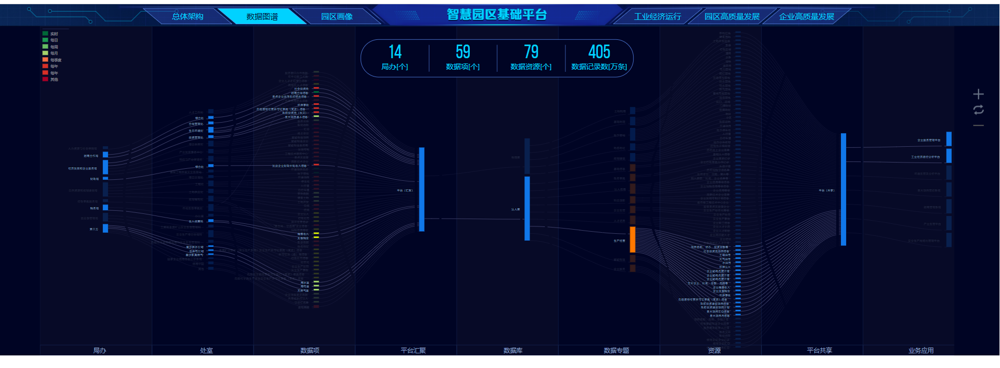

- 工作日报
	- [[今日工作]]
		- 1、苏州建行资产云平台
		  :LOGBOOK:
		  CLOCK: [2022-04-07 Thu 16:04:19]--[2022-04-07 Thu 16:04:37] =>  00:00:18
		  :END:
			- TODO jenkins前端代码cicd部署
			- DONE 力软框架代码初始化
		- DONE 2、长沙大屏数据流图
		  :LOGBOOK:
		  CLOCK: [2022-04-07 Thu 16:04:20]--[2022-04-07 Thu 16:04:21] =>  00:00:01
		  CLOCK: [2022-04-07 Thu 16:04:24]--[2022-04-07 Thu 16:04:30] =>  00:00:06
		  :END:
	- [[工作完成情况]]
		- 1、长沙大屏数据流图数据断流更改完成
		- 
		- 2、完成
	- 明日工作