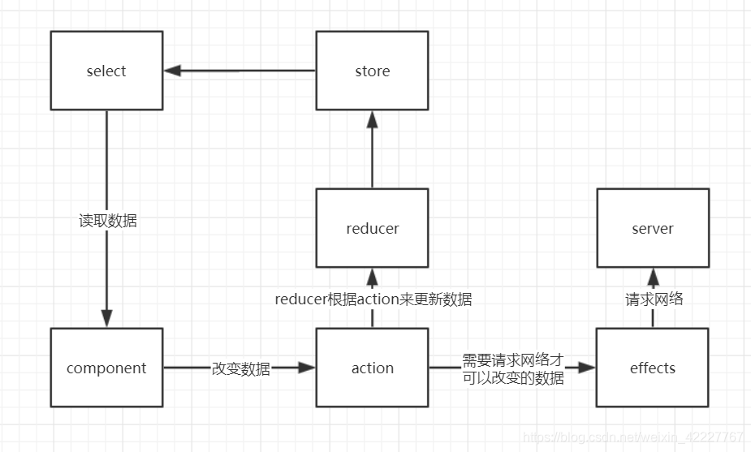

- ## Action(行为)
	- `Actions` 是信息的载体，它发送数据到 `reducer` ，然后 `reducer` 更新 `store` 。 `Actions` 是 `store` 能接受数据的唯一方式。
- ## Reducer(归约器)
	- `Reducers` 规定了行为对应的具体状态变化。是 [[纯函数]] ，通过接收前一个状态和派发行为返回新对象作为下一个状态的方式来改变状态，新对象通常用 `Object.assign` 和扩展语法来实现。
## Selector(选择器)
	- [选择器](https://blog.csdn.net/i042416/article/details/125952161) 是纯函数，它将状态切片(State slice)作为输入参数，并返回组件可以使用的状态数据切片(这些切片包含真正的业务数据)。 正如数据库有自己的 SQL 查询语言一样，Ngrx/store 模块也有自己的查询工具，即选择器。
- ## Effect（影响）
	-
- 
- ## [ngrx 入门（大部分内容都取自于这篇文章） ](https://blog.csdn.net/weixin_42227767/article/details/104562135)
-