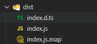

- 1、到官网注册个人npm账号
- 2、新建npm包项目文件夹，执行npm init --yes安装package.json文件，配置文件内容，比如扩展包名称，版本号，插件所依赖的插件（这块涉及到了npm一直以来的弊病），不同插件的复用性
- 3、添加对应的ts服务文件，可以是服务或是一个组件模块，对其进行编译处理为js文件，具体文件类型为（下图），
	- 其中``index.d.ts``类似于接口文件，对主文件``index.js``进行规定与注释，``index.js.map``是js文件压缩后，文件的变量名替换对应、变量所在位置等元信息数据文件
	- 
- 4、登录npm账户，``npm publish --access=public``，[地图服务](https://www.npmjs.com/package/cityfun-mapobx-service)
-
-