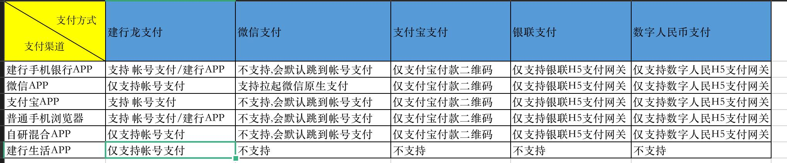

## 系统开发踩坑
- 资产缴费系统除了H5还需要开发PC端，前期不清楚该需求，导致框架选用了uniApp，由于官方无法支持 ``<route-view>``，所以PC端无法不同路由使用通用组建，例如 公用头部，然后切换tab，路由发生变化，但公用组件不发生变化；[[vue-router]][[H5开发]]
## 手机浏览器的支持情况
- 不同手机浏览器对于H5的支持显示不同 [[H5开发]]
	- 安卓阵营：小米、华为等手机厂商自带浏览器
	- ios阵营：safari浏览器
	- 通用：微信、支付宝等APP扫码访问，夸克、UC等第三方常用浏览器
	- 其中微信与支付宝扫码会导致头部导航栏与浏览器上方文字重复，所以得在这两种浏览器需要去掉头部导航栏。
## H5调用支付功能
- H5调用不同支付平台有不同的方式，针对资产缴费系统来说主要分为
- 
- 可支持的浏览器  
	- 微信App  
		- 支持微信原生支付  
		- 支持支付宝二维码支付 
		- 支持建行账号支付  
	- 普通手机浏览器  
		- 支持唤醒建行app支付[[H5调用第三方App应用]]  
		- 支持支付宝二维码支付  
		- 支持建行账号支付  
	- 支付宝  
		- 支持支付宝二维码支付  
		- 支持建行账号支付